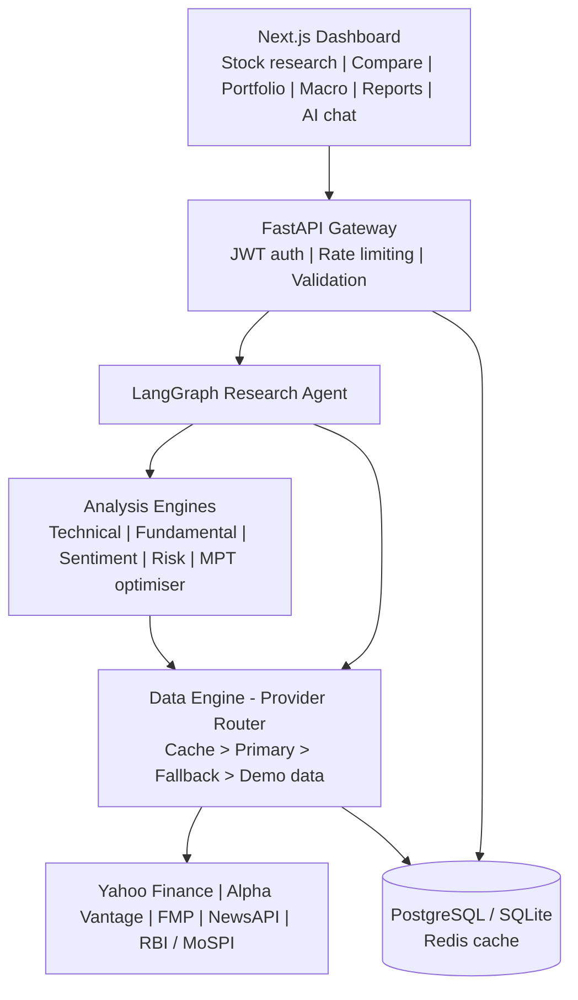
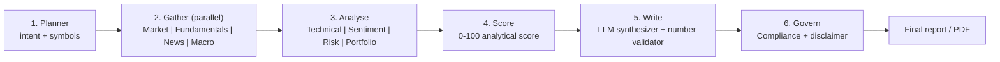

<h1 align="center">🪔 ARTHA AI</h1>

<b>AI-Powered Indian Financial Research &amp; Intelligence Platform</b> 
Python · FastAPI · LangGraph · Next.js · TypeScript · NSE / BSE 
<i>Artha (अर्थ) = wealth / economic value</i>

<h2>Overview</h2>

ARTHA AI is an agentic financial research platform for the Indian stock market. Instead of a basic price chatbot, it works like a research analyst: ask <code>Analyze RELIANCE</code> and a LangGraph workflow gathers market data, technical indicators, fundamentals, news sentiment, macro indicators, risk metrics and portfolio context, then writes an evidence-based report with analytical scores, bull/bear cases, risks and sources.

<blockquote><b>Disclaimer:</b> ARTHA AI provides financial research and analytical information for educational and informational purposes only. It does not provide personalized investment advice, recommendations, or guarantees of returns. Users should conduct independent research and consult a qualified financial professional before making investment decisions.</blockquote>

<h2>Key Features</h2>
<table>
<tr><th>Module</th><th>What it does</th></tr>
<tr><td>Market data</td><td>NSE/BSE quotes and history (<code>.NS</code> / <code>.BO</code>), INR formatting, IST market-hours handling</td></tr>
<tr><td>Technical analysis</td><td>SMA/EMA, RSI, MACD, Bollinger Bands, ATR, volume, support/resistance, trend structure</td></tr>
<tr><td>Fundamentals</td><td>P/E, P/B, ROE, margins, growth, debt ratios and a 0-100 fundamental score</td></tr>
<tr><td>News &amp; sentiment</td><td>Company news, positive/neutral/negative sentiment, sentiment momentum</td></tr>
<tr><td>Macro</td><td>RBI repo rate, inflation, GDP, USD/INR, 10Y yield and sector sensitivity</td></tr>
<tr><td>Risk engine</td><td>Volatility, beta, max drawdown, VaR, Sharpe, risk level</td></tr>
<tr><td>Portfolio + optimiser</td><td>P&amp;L, sector exposure, concentration, Modern Portfolio Theory (min-risk, max-Sharpe), what-if shocks</td></tr>
<tr><td>AI research agent</td><td>LangGraph planner, specialist nodes, number validator and compliance checker</td></tr>
<tr><td>Reports</td><td>13-section research report with PDF export</td></tr>
<tr><td>Resilience</td><td>Multi-provider fallback, caching, rate limiting and a demo-data mode</td></tr>
</table>

Keep only the rows that are actually implemented in your build. Move the rest to the Roadmap.

## Architecture

### Agent workflow (LangGraph)

All numbers come from tools and are stored in the agent state. The LLM only explains that evidence. A validator rejects figures that are not in the evidence, and a compliance node removes advice-style language and appends the disclaimer.

<h2>Tech Stack</h2>
<table>
<tr><th>Layer</th><th>Technology</th></tr>
<tr><td>Frontend</td><td>Next.js, React, TypeScript, Tailwind CSS, charting (Lightweight Charts / Recharts)</td></tr>
<tr><td>Backend</td><td>Python, FastAPI, LangGraph, pandas, NumPy, SciPy</td></tr>
<tr><td>AI</td><td>LLM via provider-agnostic interface (Gemini / Claude); FinBERT or VADER for sentiment</td></tr>
<tr><td>Data</td><td>Yahoo Finance, Alpha Vantage, Financial Modeling Prep, NewsAPI, RBI / MoSPI data</td></tr>
<tr><td>Storage</td><td>PostgreSQL (or SQLite for local), Redis (or in-memory cache)</td></tr>
<tr><td>Deployment</td><td>Docker Compose locally; Vercel + Render/Railway in production</td></tr>
</table>

<h2>Quick Start</h2>

<i>Commands below follow the planned layout. Adjust folder names or scripts to match your repo.</i>

<pre><code>git clone https://github.com/nallaramakrishna73-hub/ARTHA-AI.git
cd ARTHA-AI

# 1. Configure environment
cp .env.example .env        # add your API keys (all optional - demo mode works without them)

# 2. Backend (terminal 1)
cd backend
python -m venv .venv &amp;&amp; source .venv/bin/activate     # Windows: .venv\Scripts\activate
pip install -r requirements.txt
uvicorn app.main:app --reload --port 8000

# 3. Frontend (terminal 2)
cd frontend
npm install
npm run dev                  # opens http://localhost:3000</code></pre>

Or with Docker: <code>docker compose up --build</code>

Open <a href="http://localhost:3000">http://localhost:3000</a>. API docs (Swagger): <code>http://localhost:8000/docs</code>.

<h3>Environment variables</h3>
<table>
<tr><th>Variable</th><th>Purpose</th></tr>
<tr><td><code>LLM_PROVIDER</code>, <code>GEMINI_API_KEY</code> / <code>ANTHROPIC_API_KEY</code></td><td>Language model for planning and report writing</td></tr>
<tr><td><code>ALPHAVANTAGE_API_KEY</code>, <code>FMP_API_KEY</code></td><td>Fallback market and fundamentals data</td></tr>
<tr><td><code>NEWSAPI_KEY</code></td><td>Financial news</td></tr>
<tr><td><code>HF_TOKEN</code></td><td>FinBERT via Hugging Face Inference API (optional)</td></tr>
<tr><td><code>JWT_SECRET</code>, <code>DATABASE_URL</code>, <code>REDIS_URL</code></td><td>Auth and storage</td></tr>
<tr><td><code>DEMO_MODE</code></td><td>Use bundled sample data when keys or providers are unavailable</td></tr>
</table>

<h2>Usage Examples</h2>
<ul>
<li><code>Analyze RELIANCE.NS</code> - full multi-agent research report</li>
<li><code>Compare TCS.NS and INFY.NS</code> - side-by-side comparison</li>
<li><code>How could higher interest rates affect Indian banking stocks?</code> - macro explanation</li>
<li><code>What happens to my portfolio if the market falls 10%?</code> - what-if scenario</li>
</ul>

Sample symbols: <code>RELIANCE.NS</code>, <code>TCS.NS</code>, <code>INFY.NS</code>, <code>HDFCBANK.NS</code>, <code>ICICIBANK.NS</code>, <code>SBIN.NS</code>

<h2>Data Sources &amp; Resilience</h2>

Requests go through a provider router: cache, primary provider, fallback provider, stale cache, then sample data. Free market feeds are delayed, so data is shown as near real-time with a "data as of" timestamp.

<h2>Security &amp; Compliance</h2>
<ul>
<li>JWT authentication, hashed passwords, input validation, rate limiting</li>
<li>API keys kept server-side in environment variables, never in the frontend</li>
<li>Audit logs and a compliance node that blocks buy/sell/guarantee language</li>
<li>Educational and informational use only - no personalised investment advice</li>
</ul>

<h2>Project Structure</h2>
<pre><code>ARTHA-AI/
├── backend/
│   └── app/  api/  agents/  analysis/  providers/  services/  models/  sample_data/
├── frontend/
│   ├── app/  components/  lib/
├── docs/  architecture.md  api.md  security.md  screenshots/
├── docker-compose.yml
├── .env.example
└── README.md</code></pre>

<h2>Roadmap</h2>

Tick what is truly done before you submit.

<ul>
<li>&#9744; Market data + multi-provider fallback</li>
<li>&#9744; Technical analysis engine and charts</li>
<li>&#9744; LangGraph research agent</li>
<li>&#9744; News sentiment (FinBERT / VADER)</li>
<li>&#9744; Fundamentals and macro dashboard</li>
<li>&#9744; Risk engine, portfolio analytics, MPT optimiser</li>
<li>&#9744; PDF research reports</li>
<li>&#9744; Smart alerts (price, RSI, EMA cross, news)</li>
<li>&#9744; Options Lab (Black-Scholes, Greeks)</li>
<li>&#9744; Live broker feed (Kite Connect)</li>
</ul>

<h2>Testing</h2>
<pre><code>cd backend &amp;&amp; pytest
cd frontend &amp;&amp; npm run lint &amp;&amp; npm run build</code></pre>

<h2>Author</h2>

<b>Ramakrishna Janhvi</b> - Cybersecurity student and developer, Telangana, India. 
Built for the Capabl Financial Research AI Agent Development project (Track B).

<h2>License</h2>

Add your license here (for example MIT) and keep the disclaimer above in the app and docs.

ARTHA AI - research and analytics only. Not investment advice.

